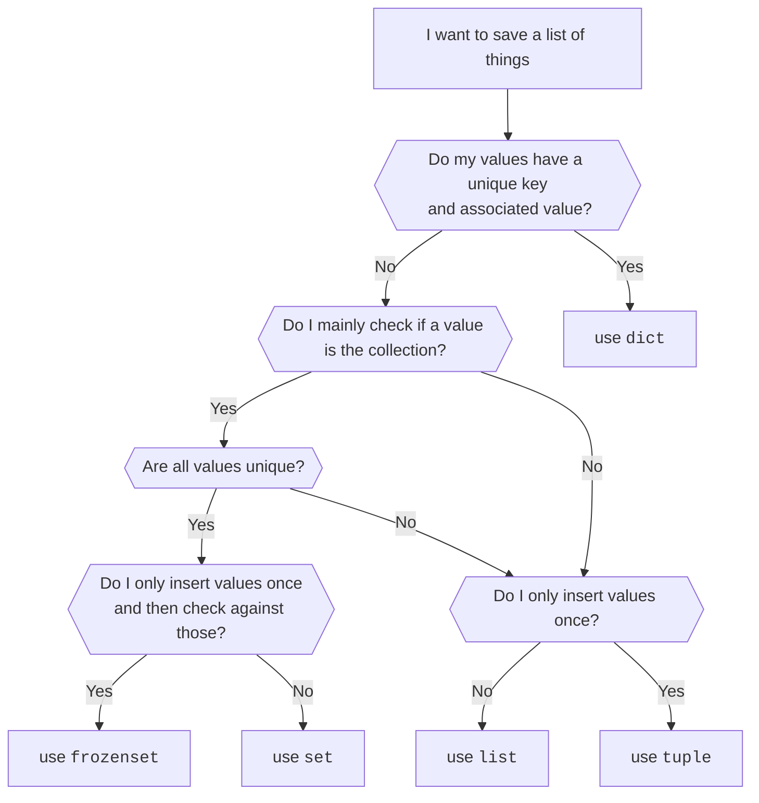

# Data Structures

In the previous chapters we have talked about primitive data types, such as `int`, `float`, `bool`, `str`, and `None`.
These are the basic building blocks of any program, but they are not enough to solve most real-world problems. In this
chapter we will introduce more complex data types, which are called **data structures**.

We will cover the following data structures:

* [Lists](00-lists.md)
* [Tuples](01-tuples.md)
* [Sets](02-sets.md)
* [Dictionaries](03-dictionaries.md)
* [Dataclasses](04-data-classes.md)
* [Enumerations](05-enums.md)

## Guidance

If you don't know which type of collection to use, here is a simple decision diagram:

