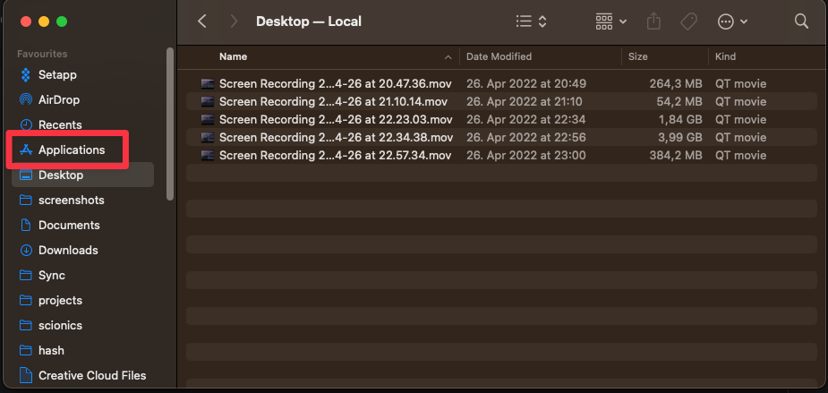
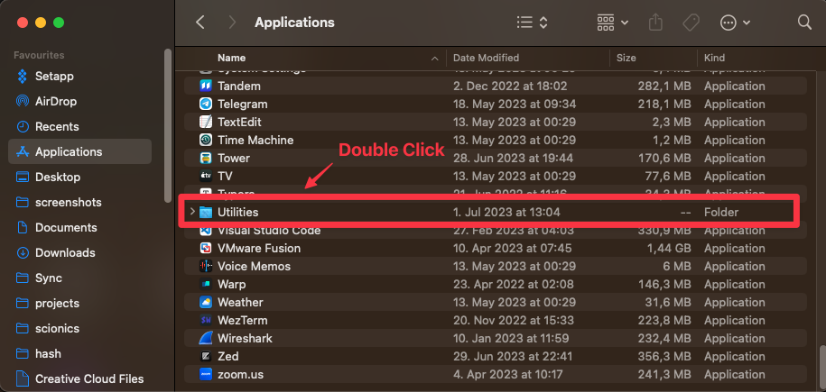
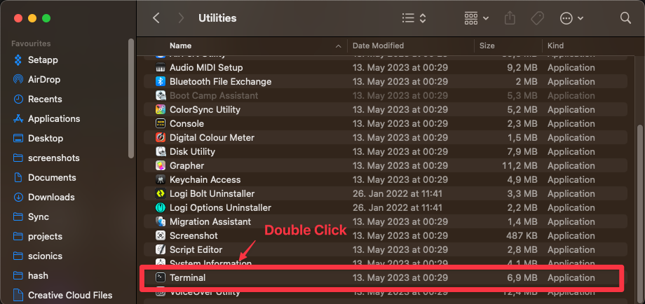

# Bash Cheat Sheet

## Opening the Terminal

```admonish info

This section is only applicable to macOS users.

```

You can open the terminal by either opening the application `Terminal` or by searching for `Terminal` in `Spotlight`.

`Spotlight` can be opened by pressing <kbd>⌘</kbd> + <kbd>Space</kbd>.

### Opening the Terminal via Finder

You can also open the terminal by opening the `Finder` application and navigating
to `Applications` > `Utilities` > `Terminal`.

```admonish note title="Visual Guide" collapsible=true





```

## Navigating the Terminal

### Changing Directories

You can change directories by using the `cd` command. (cd stands for **c**hange **d**irectory)

```bash
cd <path>
```

The `<path>` can be either an absolute path or a relative path.

```admonish tip title="Clarification" collapsible=true

What is the difference between an absolute path and a relative path?

The absolute path is the full path to a directory, for example `/Users/username/Documents`, it is the path from the root,
for example in macOS your user directory is located at `/Users/username`.

A relative path is a path relative to your current directory, for example if you are in the directory `/Users/username`
and you want to go to the directory `/Users/username/Documents` you can use the relative path `Documents`. 

You can also use relative paths to go up in the directory tree, for example if you are in the directory `/Users/username/Documents` 
and you want to go to the directory `/Users/username` you can use the relative path `..`.

To navigate to your home directory you can use the relative path `~`.

You can also use the relative path `.` to refer to the current directory.


You can freely combine those path modifiers, for example if you are in the directory `/Users/username/Documents` and 
you want to go to the directory `/Users/username/Downloads` you can use the relative path `../Downloads`.

Or if you want to navigate to `/Users/bob/Documents`, and your username is `alice`, you can use `~/../bob/Documents`.
This roughly translates to:
1) Go to my home directory (`~`), which is `/Users/alice`.
2) Go up one directory (`..`), which is `/Users`.
3) Go to the directory `bob/Documents`, which is `/Users/bob/Documents`.

```

### Listing Files

You can list the files in your current directory by using the `ls` command. (ls stands for **l**i**s**t)

```bash
ls
```

You can also list the files in a different directory by specifying the directory as an argument.

```bash
ls <path>
```

`ls` has several options that can be used to change its behavior, these include:

* `-a` - Show all files, including hidden files. (`a` stands for **a**ll)
* `-l` - Show the long format of the files. (`l` stands for **l**ong)
* `-h` - Show the file sizes in human readable format. (`h` stands for **h**uman readable)

You can combine these options, for example to show all files in the long format you can use `ls -al`.

> **Note:** I recommend using `ls -lah` as your default `ls` command.

### Creating Directories

You can create directories by using the `mkdir` command. (mkdir stands for **m**a**k**e **dir**ectory)

```bash
mkdir <path>
```

This will error out if the directory already exists, or you don't have the permissions to create the directory.

To create a nested directory structure you can use the `-p` option. (p stands for **p**arents)

```bash
mkdir -p <path>
```

This will create all the directories in the path that don't already exist.

### Removing Directories

You can remove directories by using the `rmdir` command. (rmdir stands for **r**e**m**ove **dir**ectory)

```bash
rmdir <path>
```

This will only remove the directory if it is empty.

> **Note:** This command is seldom used, as it is often more convenient to use `rm -rf`.

### Copying Files

You can copy files by using the `cp` command. (cp stands for **c**o**p**y)

```bash
cp <source> <destination>
```

You can also copy directories by using the `-r` option. (r stands for **r**ecursive)

```bash
cp -r <source> <destination>
```

### Moving Files and Directories

You can move files and directories by using the `mv` command. (mv stands for **m**o**v**e)

```bash
mv <source> <destination>
```

To rename a file or directory, you also use the `mv` command.

```bash
mv <original-name> <new-name>
```

This will error out if the destination already exists, or you don't have the permissions to move the file or directory.

### Removing Files and Directories

You can remove files and directories by using the `rm` command. (rm stands for **r**e**m**ove)

```bash
rm <path>
```

You can also remove directories by using the `-r` option. (r stands for **r**ecursive)

```bash
rm -r <path>
```

This will ask for confirmation if you are trying to remove a directory, to skip the confirmation you can use the `-f`
option. (f stands for **f**orce)

```bash
rm -rf <path>
```

> **Note:** This command is very dangerous, as it will remove the directory and all its contents without asking for
> confirmation.
> Double check that you are removing the correct directory before running this command.

This will error out if the file or directory doesn't exist, or you don't have the permissions to remove the file or
directory.

### Creating Files

You can create files by using the `touch` command.

```bash
touch <path>
```

This will create an empty file at the specified path.

### Opening Files

You can open files by using the `open` command.

```bash
open <path>
```

This will open the file with the default application for that file type.

```admonish tip

On macOS you can also use `open .` to open the current directory in Finder.

```

### Printing Files

You can print files by using the `cat` command. (cat stands for **cat**enate)

```bash
cat <path>
```

This will print the contents of the file to the terminal.

```admonish tip title="Trivia" collapsible=true

Showing the contents of a file is called **cat**enating the file, because the `cat` command can be used to concatenate multiple files together.

For example if you have two files `file1.txt` and `file2.txt` you can concatenate them together by using `cat file1.txt file2.txt`.

```

### Searching Files

You can search files by using the `grep` command. (grep stands for **g**lobal **r**egular **e**xpression **p**rint)

```bash
grep <pattern> <path>
```

This will print all the lines in the file that match the specified pattern.

### Finding Files

You can find files by using the `find` command.

```bash
find <path> -name <pattern>
```

This will print all the files in the specified path that match the specified pattern.

### Editing Files

You can edit files by using the `nano` command.

```bash
nano <path>
```

This will open the file in the nano text editor. There are a multitude of other text editors available, but nano is the
easiest to use.

To open a file in VSCode you can use the `code` command.

```bash
code <path>
```

### Current Working Directory

You can print the current working directory by using the `pwd` command. (pwd stands for **p**rint **w**orking **d**
irectory)

```bash
pwd
```

## Interacting with Python

Python has two modes of operation, interactive mode and script mode.

### Interactive Mode

You can start Python in interactive mode by running the `python` command.

```bash
python
```

This will start the Python REPL (Read-Eval-Print-Loop), which is a program that reads Python code, evaluates it, prints
the result, and then loops back to read the next line of code.

This mode is useful for testing out small snippets of code, but is not suitable for writing large programs. Nothing you
do in interactive mode will be saved, so you will have to retype everything the next time you start Python.

To exit the Python REPL you can use the `exit()` function (or press <kbd>Ctrl</kbd>+<kbd>D</kbd>)

```python
exit()
```

### Script Mode

You can run Python scripts by using the `python` command.

```bash
python <path>
```

This will run the Python script at the specified path.
